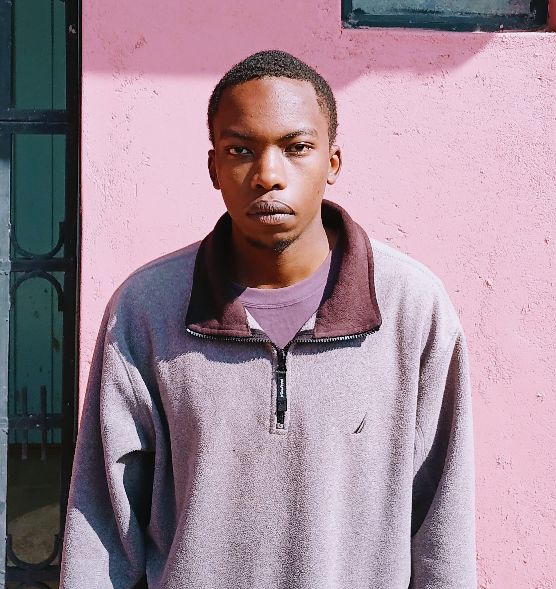

# 🟢 matrix — Matrix rain over your face

A static ghost of your face glows behind classic Matrix rain in the terminal.
The photo (or detected face) is used as a brightness map, rendered as a
persistent low-brightness layer while katakana rain falls over it.



## ✨ Features

- Ghost of your face (default 28% brightness) with Matrix rain falling over it
- Auto-detects the face in the photo (OpenCV Haar cascade)
- Works right after `git clone` — the default photo ships in `ref/`
- Ctrl+C exits cleanly and restores your terminal

## 🚀 Quick start

```bash
git clone https://github.com/Tony46117/matrix-face.git
cd matrix-face

# 1) install dependencies (Python 3.8+)
pip install -r requirements.txt        # numpy, Pillow; OpenCV is optional
#    (on Ubuntu 23.04+/Fedora: pip install --break-system-packages -r requirements.txt
#     or create a venv: python3 -m venv .venv && source .venv/bin/activate)

# 2) run it
./matrix
```

That's it — it uses the bundled photo in `ref/`. To use your own:

```bash
./matrix ~/my-photo.jpg
./matrix ~/some-directory          # newest image in a directory
```

### Install to PATH (optional)

```bash
./install.sh                       # copies to ~/.local/bin/matrix
matrix
```

## 🎛 Options

| Flag            | Default | What it does                                  |
| --------------- | ------- | --------------------------------------------- |
| `--ghost N`     | `0.28`  | Static face glow behind the rain (0..1)       |
| `--fps N`       | `30`    | Frames per second                             |
| `--speed N`     | `1.0`   | Rain speed multiplier                         |
| `--invert`      | off     | Invert the face mask                          |
| `--no-crop`     | off     | Use the whole image, not just the detected face |
| `--cols N`      | auto    | Force grid width                              |
| `--rows N`      | auto    | Force grid height                             |

## 🖼 Photo lookup order

1. Explicit path argument (`matrix /path/to/img.jpg`)
2. Bundled `ref/` folder next to the script (works after clone)
3. `~/Desktop/ref` (local override — drop photos there and it picks the newest)

## 📦 Dependencies

- `numpy` — required
- `Pillow` — required
- `opencv-python` — optional (fallback to Pillow resize + no face crop if missing)

## 🛡 License

MIT
